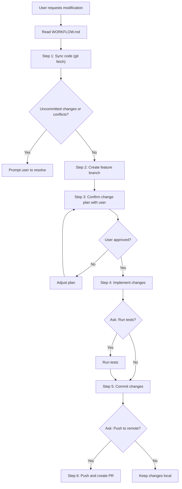

# Git Workflow Rules for AI Agent

> **Purpose**: This document defines the standard Git workflow that the AI agent must follow when making changes to this project.

## Workflow Overview



---

## Step-by-Step Process

### Step 1: Sync Code

Before making any changes, ensure the local repository is up to date.

```bash
# Fetch latest changes from remote
git fetch origin develop

# Check current status
git status

# If on a stale branch, pull latest develop
git checkout develop
git pull origin develop
```

**If uncommitted changes exist:**
- Prompt the user to either commit, stash, or discard changes before proceeding.

**If merge conflicts exist:**
- Notify the user and assist in resolving conflicts before continuing.

---

### Step 2: Create Feature Branch

Create a new branch following the naming convention.

**Branch Naming Format:**
```
feature/<username>/<feature-description>
```

**Examples:**
- `feature/gyy/add-audio-preprocessing`
- `feature/john/fix-training-callback`
- `feature/alice/refactor-workflow-engine`

**Commands:**
```bash
# Create and switch to new branch from develop
git checkout develop
git checkout -b feature/<username>/<description>
```

---

### Step 3: Confirm Change Plan

Before implementing any changes, the AI agent must:

1. **Analyze the request** - Understand what the user wants to achieve
2. **Create a plan** - Use Cursor's Plan Mode / `create_plan` tool
3. **Present the plan** - Show the user:
   - Files to be modified
   - Summary of changes
   - Potential impacts
4. **Get user approval** - Wait for explicit confirmation before proceeding

**Do NOT proceed with code changes until the user explicitly approves the plan.**

---

### Step 4: Implement Changes

Follow the project's coding standards defined in [coding_standards.md](../rules/coding_standards.md):

- Adhere to PEP 8 style guide
- Use type hints
- Write docstrings in English
- Follow the import order convention
- Respect the MVC + Controller architecture

---

### Step 5: Test (If Requested)

Ask the user: **"Do you want me to run tests for these changes?"**

If yes:
```bash
# Run project tests
pytest tests/

# Or run specific test file
pytest tests/test_<module>.py
```

For UI changes, use browser tools to verify functionality if applicable.

---

### Step 6: Commit Changes

Use **Conventional Commits** format for all commit messages.

**Format:**
```
<type>(<scope>): <description>

[optional body]

[optional footer]
```

**Types:**
| Type | Description |
|------|-------------|
| `feat` | New feature |
| `fix` | Bug fix |
| `docs` | Documentation changes |
| `style` | Code style changes (formatting, no logic change) |
| `refactor` | Code refactoring |
| `test` | Adding or updating tests |
| `chore` | Maintenance tasks |

**Examples:**
```bash
git add .
git commit -m "feat(workflow): add audio augmentation node"
git commit -m "fix(training): resolve memory leak in data generator"
git commit -m "docs(readme): update installation instructions"
```

---

### Step 7: Push and Create Pull Request

Ask the user: **"Do you want me to push these changes and create a Pull Request?"**

If yes:

**Push to remote:**
```bash
git push -u origin feature/<username>/<description>
```

**Create Pull Request:**
- Target branch: `develop`
- Use the PR template below

---

## Pull Request Template

When creating a PR, include the following information:

```markdown
## Summary
<!-- Brief description of what this PR does -->

## Changes Made
<!-- List of specific changes -->
- 
- 
- 

## Files Modified
<!-- List of files that were changed -->
- 
- 

## Testing
<!-- Describe testing performed -->
- [ ] Unit tests passed
- [ ] Manual testing completed
- [ ] No tests required (documentation only)

## Related Issues
<!-- Link any related issues -->
Closes #

## Additional Notes
<!-- Any other relevant information -->
```

---

## Security Checks

Before committing, verify that the changes do NOT include:

- [ ] API keys or secrets
- [ ] Passwords or credentials
- [ ] Personal access tokens
- [ ] Sensitive file paths
- [ ] Private user data

If any sensitive information is detected, alert the user immediately.

---

## Conflict Resolution

If conflicts are detected during sync or merge:

1. **Notify the user** about the conflicting files
2. **Show the conflict details** if possible
3. **Ask for guidance** on how to resolve:
   - Accept incoming changes
   - Keep current changes
   - Manual merge required
4. **Assist with resolution** as directed by the user

---

## Rollback Procedure

If changes need to be reverted:

```bash
# Discard uncommitted changes
git checkout -- .

# Revert last commit (keep changes staged)
git reset --soft HEAD~1

# Revert last commit (discard changes)
git reset --hard HEAD~1

# Revert a specific commit
git revert <commit-hash>
```

Always confirm with the user before performing any destructive operations.

---

## Quick Reference

| Action | Command |
|--------|---------|
| Sync code | `git fetch origin develop` |
| Create branch | `git checkout -b feature/<user>/<desc>` |
| Stage all | `git add .` |
| Commit | `git commit -m "type(scope): message"` |
| Push | `git push -u origin <branch>` |
| Switch branch | `git checkout <branch>` |
| Check status | `git status` |
| View log | `git log --oneline -10` |

---

## Related Documents

- [rules.mdc](../rules.mdc) - Project rules entry point
- [architecture.md](../rules/architecture.md) - Project architecture documentation
- [coding_standards.md](../rules/coding_standards.md) - Coding standards
- [model_json_spec.md](../rules/model_json_spec.md) - Model JSON specification
